# .NET 架构程序设计课程

## 目录
- [第一次作业](#第一次作业)
- [第二次作业](#第二次作业)
- [第三次作业](#第三次作业)
- [第四次作业](#第四次作业)
- [第五次作业](#第五次作业)

## 课后作业

### 第一次作业

#### Hello, world!

在控制台中输出 `Hello, world!`

#### 素数因子分解

输入正整数，输出其质因数分解结果

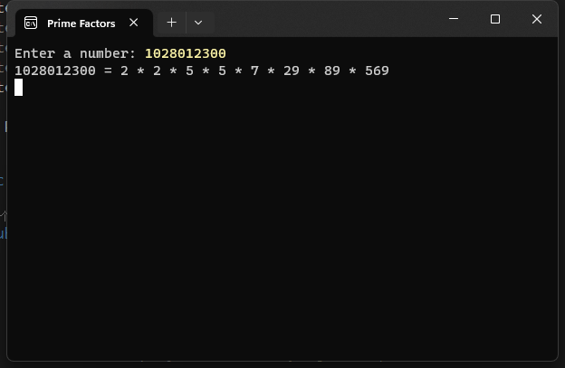

#### 口算自动出题机

自动出 100 以内的加减法计算题，每道题限时并在提交时评分

- 倒计时结束时提交本题，展示答题是否正确，并自动下一题

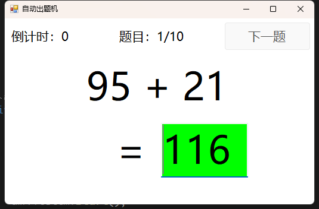

- 答题错误时显示红色

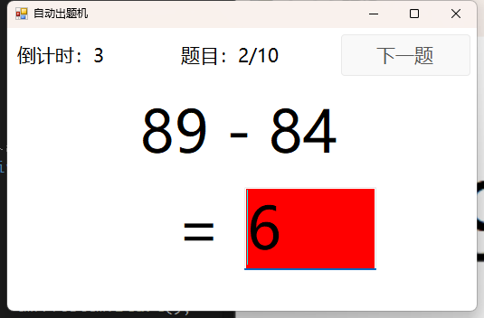

- 完成所有题目后交卷，统计得分

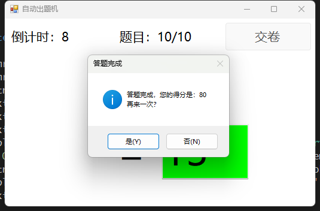

### 第二次作业

#### ATM 机模拟器

模拟 ATM 机的账户验证、存取款等操作

账户分为普通账户和信用账户，存款时以 30% 概率模拟坏钞异常，进行 10000.00 以上的大额取款时显示警告信息

- 账户验证

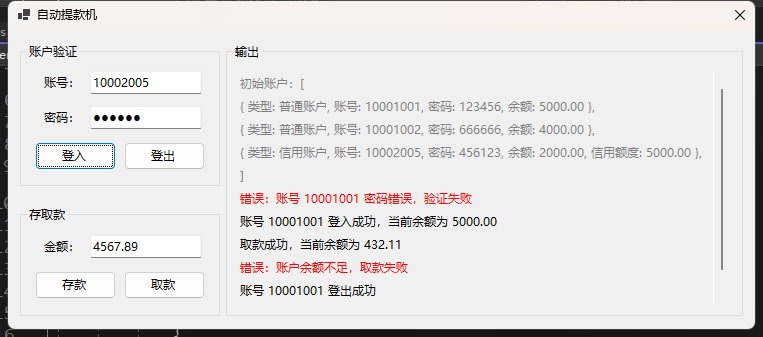

- 存取款

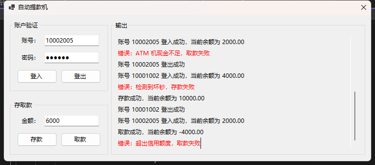

- 大额取款警告

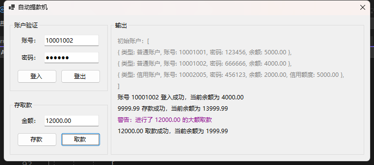

### 第三次作业

#### 代码格式化与统计程序

对 C# 代码进行处理，去除 `//` 开头的注释，划分其中的英文单词，并统计词频

> 匹配单词的正则表达式：
> ```
> ((?<![0-9][A-Za-z]*)[A-Z]?[a-z]+)|((?<![0-9][A-Za-z]*)[A-Z]+(?![a-z]+))
> ```
> 
> 例：
> > ```
> > abcDEFGhiJKL
> > AbcDefGHIJkl
> > 0xBCD8AB95
> > 1Aaa1 2aAa2 3aaA3
> > ```
> > 匹配到的单词：
> > ```
> > abc DEF Ghi JKL Abc Def GHI Jkl
> > ```

- 打开 `.cs` 文件

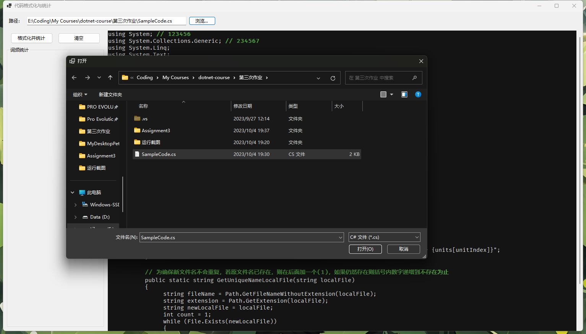

- 显示代码内容

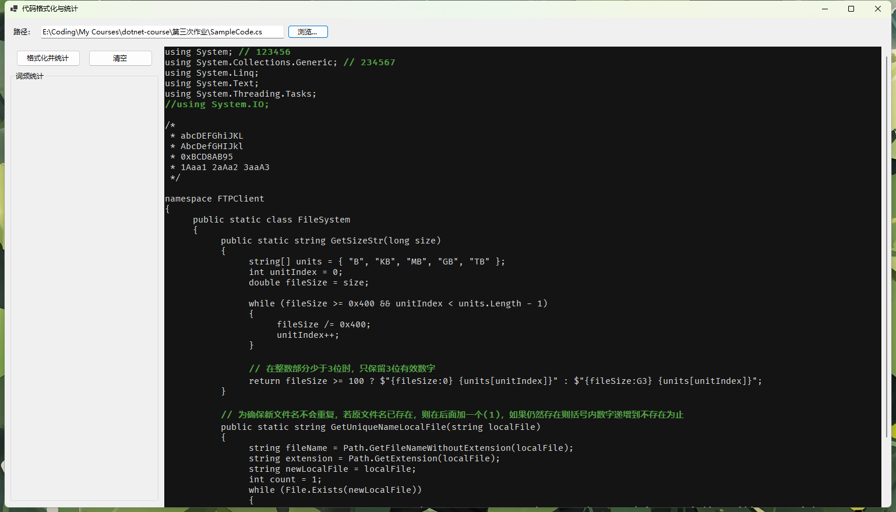

- 去除注释，分词，统计词频

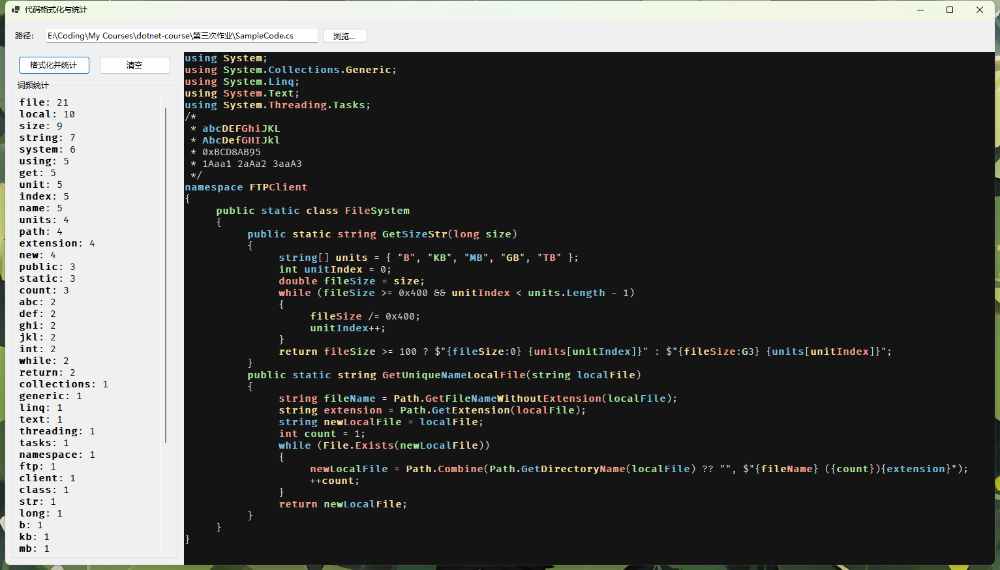

### 第四次作业

#### 简单文件浏览器程序

实现文件浏览器的基本功能

支持上层目录和历史记录跳转，改变文件列表视图

> 使用双向链表结点 `DirHistoryNode` 维护历史记录

- 展开目录结点

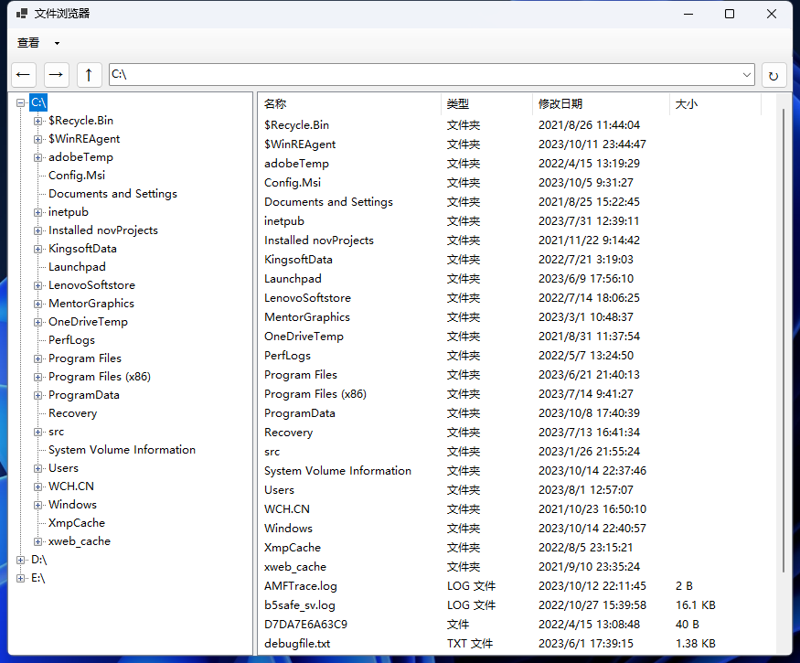

- 双击打开文件

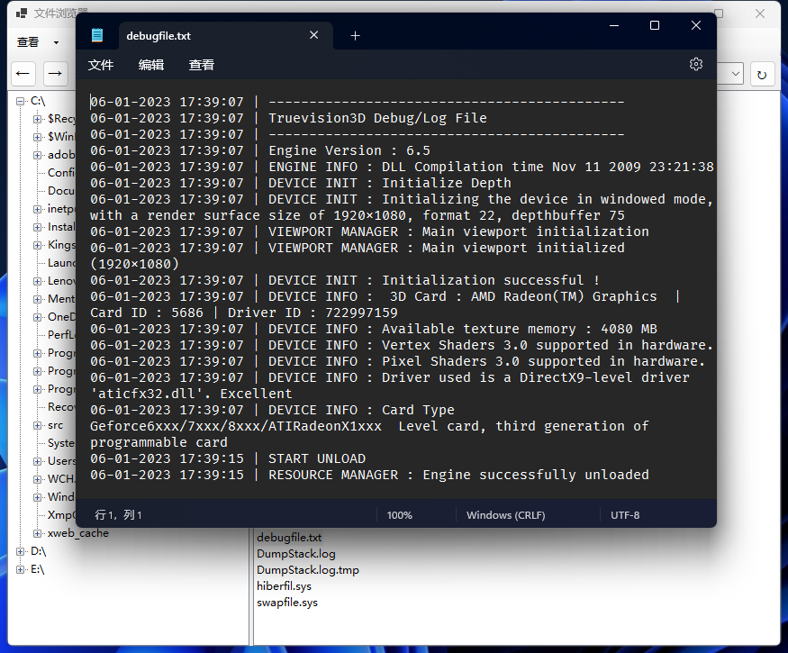

- 通过下拉框访问历史记录，或按【←】【→】按钮在历史记录中跳转

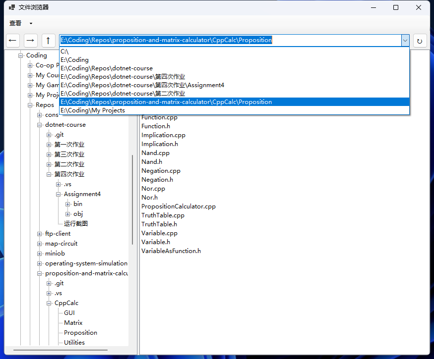

- 更改显示方式

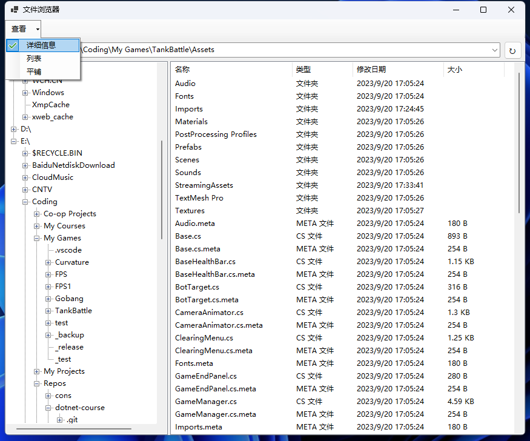

### 第五次作业

#### 电话号码爬虫程序

爬取特定关键字的网页搜索结果中的电话号码，并显示已爬取的 URL
昨天生病耽误了些时间，现在还在写——